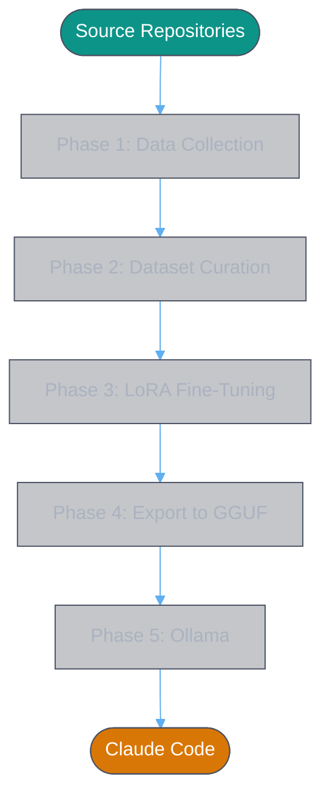
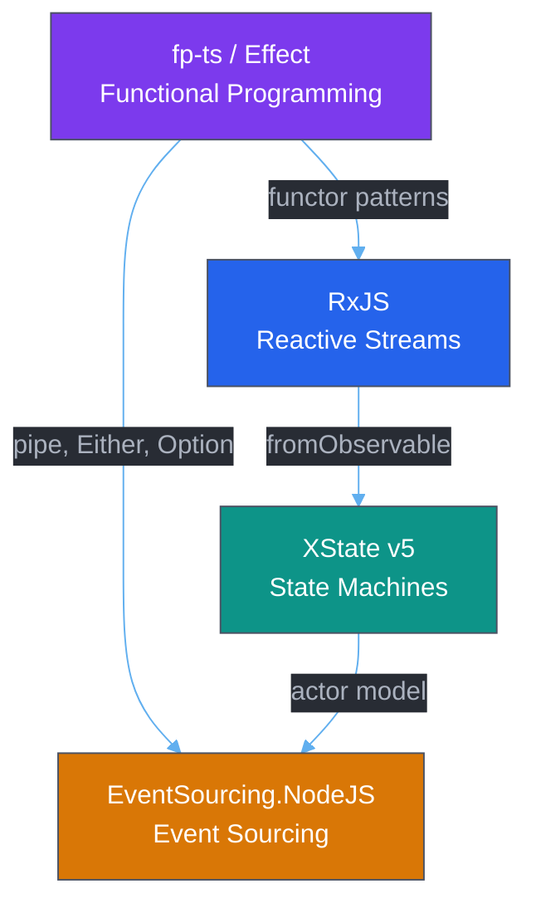
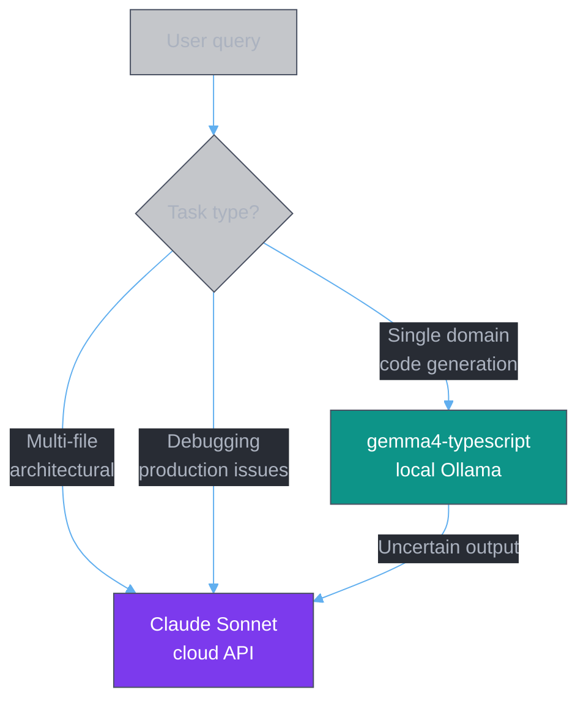
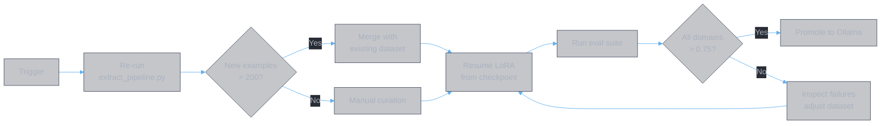

# TypeScript-Specialised Local LLM Pipeline
### Design Document v2.0

---

## Table of Contents

1. [Overview](#1-overview)
2. [Goals and Non-Goals](#2-goals-and-non-goals)
3. [Hardware Setup](#3-hardware-setup)
4. [System Architecture](#4-system-architecture)
5. [Phase 1 — Data Collection](#5-phase-1--data-collection)
6. [Phase 2 — Dataset Curation](#6-phase-2--dataset-curation)
7. [Phase 3 — LoRA Fine-Tuning](#7-phase-3--lora-fine-tuning)
8. [Phase 4 — Export and Quantisation](#8-phase-4--export-and-quantisation)
9. [Phase 5 — Ollama Integration](#9-phase-5--ollama-integration)
10. [Phase 6 — Claude Code Integration](#10-phase-6--claude-code-integration)
11. [Phase 7 — Evaluation](#11-phase-7--evaluation)
12. [Maintenance and Retraining](#12-maintenance-and-retraining)
13. [Appendix — File Structure](#13-appendix--file-structure)

---

## 1. Overview

Most frontier models are trained predominantly on imperative, OOP-style codebases. This means they produce mediocre output when asked to write idiomatic functional programming, reactive streams, state machines, or event-sourced aggregates in TypeScript — even though high-quality reference implementations of all four domains exist in the open-source ecosystem.

This document describes a full pipeline to:

1. Extract high-quality TypeScript training examples from curated open-source repositories
2. Shape them into `(instruction, completion)` pairs
3. Fine-tune **Qwen3-14B** and **Gemma 4 31B** via QLoRA on a local RTX 5090
4. Serve the resulting model via **Ollama**
5. Integrate it with **Claude Code** as a drop-in local backend

The result is a private, offline TypeScript assistant that writes FP, reactive, XState v5, and event-sourced code the way domain experts do.

---

## 2. Goals and Non-Goals

### Goals

- Produce a model that writes idiomatic TypeScript in four target domains
- Keep all data and weights entirely local — no code leaves the machine
- Make the pipeline fully reproducible so it can be re-run when dependencies update
- Integrate cleanly with Claude Code without any changes to the agent itself

### Non-Goals

- Replacing frontier models for architectural reasoning or multi-repo refactors
- General-purpose coding across all languages
- Beating Claude Sonnet on SWE-bench (different objective)
- Serving multiple users concurrently

---

## 3. Hardware Setup

| Component | Spec |
|---|---|
| GPU | NVIDIA RTX 5090 (Blackwell, 32 GB GDDR7) |
| System RAM | 128 GB |
| Memory bandwidth | 1,792 GB/s |
| Inference runtime | Ollama |
| Fine-tuning runtime | Unsloth + HuggingFace PEFT |
| Base model candidates | Qwen3-14B (dense), Gemma 4 31B (dense) |

### Model selection

Two candidate models are trained and evaluated. The final choice is made after Phase 7 evaluation on the four target domains.

**Why these two models:**

- **Qwen3-14B** — comfortable VRAM fit (Q8_0 at ~14 GB), strong code generation baseline, well-studied QLoRA path with Unsloth, Apache 2.0 license. Qwen3-14B matches Qwen2.5-32B in benchmarks.
- **Gemma 4 31B** — highest coding benchmark in the Gemma family (80% LiveCodeBench v6), tight but proven on RTX 5090 at Q6_K. More raw capacity for domain adaptation.

**Why not Gemma 4 26B-A4B MoE:** Despite excellent inference performance (77% LiveCodeBench with only 3.8B active params), MoE models require 16-bit LoRA (not 4-bit QLoRA) due to expert routing interactions. This pushes VRAM requirements above 40 GB, exceeding the RTX 5090's 32 GB.

### VRAM budget for inference

#### Qwen3-14B

| Quantisation | VRAM | KV Cache Headroom | Quality vs FP16 |
|---|---|---|---|
| FP16 | ~28 GB | ~4 GB | Baseline — tight |
| **Q8_0** | **~14 GB** | **~18 GB** | **~99% — recommended** |
| Q6_K | ~11 GB | ~21 GB | ~98.5% |
| Q4_K_M | ~8 GB | ~24 GB | ~97% |

#### Gemma 4 31B

| Quantisation | VRAM | KV Cache Headroom | Quality vs FP16 |
|---|---|---|---|
| FP16 | ~62 GB | — | Does not fit |
| Q8_0 | ~31 GB | ~1 GB | ~99% — too tight |
| **Q6_K** | **~24 GB** | **~8 GB** | **~98.5% — recommended** |
| Q4_K_M | ~17 GB | ~15 GB | ~97% |

#### Comparison summary

| | Qwen3-14B @ Q8_0 | Gemma 4 31B @ Q6_K |
|---|---|---|
| Raw model capacity | 14B | 31B |
| Quantisation loss | ~1% | ~1.5% |
| KV cache headroom | ~18 GB | ~8 GB |
| Inference speed | ~2× faster | Baseline |
| Training flexibility | Batch 4–8 | Batch 2 |
| Code baseline | Strong (Qwen3 code strength) | 80% LiveCodeBench v6 |

If both models score comparably on the Phase 7 domain evaluations, prefer Qwen3-14B for its faster inference, higher quantisation fidelity, and more comfortable VRAM profile.

### VRAM budget for fine-tuning

QLoRA fine-tuning keeps base model weights frozen in 4-bit on GPU. Optimizer states and activations spill into system RAM:

$$\text{VRAM}_{\text{train}} = \text{model}_{4\text{bit}} + \text{LoRA weights} + \text{activations}_{\text{batch}}$$

#### Qwen3-14B

$$\approx 7\text{ GB} + 0.3\text{ GB} + 1.5\text{ GB} \approx 9\text{ GB}$$

Leaves ~23 GB headroom. Batch size can increase to 4–8, improving gradient estimates and training speed.

#### Gemma 4 31B

$$\approx 17\text{ GB} + 0.5\text{ GB} + 2\text{ GB} \approx 20\text{ GB}$$

Leaves ~12 GB headroom. Batch size constrained to 2 with gradient accumulation.

The remaining ~100 GB of system RAM is more than sufficient for AdamW optimizer states for either model.

### Disk space budget

Training two models produces significant artifacts. Ensure at least 300 GB free before starting:

| Artifact | Qwen3-14B | Gemma 4 31B |
|---|---|---|
| HuggingFace cache (4-bit) | ~8 GB | ~18 GB |
| Checkpoints (3 epochs) | ~28 GB | ~62 GB |
| Merged model (full precision) | ~28 GB (BF16) | ~62 GB (F16) |
| GGUF F16 intermediate | ~28 GB | ~62 GB |
| GGUF quantised (final) | ~14 GB (Q8_0) | ~24 GB (Q6_K) |
| **Subtotal** | **~106 GB** | **~228 GB** |

Clean up intermediate files after each phase to reduce peak usage. The export script should delete the merged HF model and F16 GGUF after quantisation completes:

```bash
# After successful quantisation
rm -rf ./${MODEL_KEY}-typescript-merged/
rm -f ./gguf/${MODEL_KEY}-typescript-f16.gguf
```

**Note:** The FP16 merge step for Gemma 4 31B loads ~62 GB into system RAM. Close Ollama and other memory-intensive processes before running `export.sh` for the 31B model.

---

## 4. System Architecture

### End-to-end overview



### Data flow detail


### Domain dependency map



The training order follows this dependency graph: FP fundamentals first, then reactive, then XState, then event sourcing. Each domain builds on the vocabulary of the one before it.

---

## 5. Phase 1 — Data Collection

### 5.1 Source repositories

| Repo | Domain | Why it is gold |
|---|---|---|
| `gcanti/fp-ts` | FP | Canonical TS FP — ADTs, HKTs, type classes done correctly |
| `Effect-TS/effect` | FP | Modern FP at production scale |
| `ReactiveX/rxjs` | Reactive | Operator implementations + marble tests |
| `statelyai/xstate` | XState v5 | Full v5 API including `setup()`, typed actors |
| `oskardudycz/EventSourcing.NodeJS` | Event sourcing | Best TS event sourcing reference available |

### 5.2 Clone strategy

```bash
for repo in "${REPOS[@]}"; do
  git clone --depth=1 "$repo" ./repos/$(basename "$repo")
done
```

`--depth=1` is sufficient for file extraction. Use a full clone only when mining git history for diffs.

### 5.3 File filtering

Skip the following patterns — they add noise without domain signal:

```
*.d.ts          # generated type declarations
node_modules/   # third-party code
dist/ build/    # compiled output
*.spec.ts       # test files (handled separately)
*.test.ts
```

Only process files containing at least one **focus term** per domain:

| Domain | Focus terms |
|---|---|
| fp | `pipe(` `flow(` `Option<` `Either<` `Task<` `Reader` |
| reactive | `Observable<` `Subject` `switchMap(` `mergeMap(` `combineLatest` |
| xstate | `setup(` `createMachine(` `fromPromise(` `fromObservable(` `assign(` |
| eventsourcing | `Aggregate` `evolve(` `Command` `EventStore` `append(` `readStream(` |

### 5.4 Semantic unit types

Three types of unit are extracted, in priority order:

**1. Exported functions and arrow functions**

```typescript
// Example — fp-ts Either
export const tryCatch = <E, A>(
  f: Lazy<A>,
  onThrow: (reason: unknown) => E
): Either<E, A> => { ... }
```

**2. Type aliases and interfaces**

```typescript
// Example — XState v5 event union
export type ShoppingCartEvent =
  | { type: 'ITEM_ADDED';   item: CartItem    }
  | { type: 'ITEM_REMOVED'; itemId: string    }
  | { type: 'CHECKED_OUT'                     }
```

**3. Git commit diffs**

Git history is the most underused training source. Each commit represents an intentional design decision. Before/after diffs teach the model *why* patterns change, not just what they look like:

```bash
git log --oneline --no-merges -n 300   # list candidates
git show <hash> -- "*.ts"              # extract TS-only diff
```

### 5.5 Context extraction

Each unit is accompanied by the file's import block. This grounds the model in the dependency graph and prevents it from generating code that assumes unavailable imports:

```typescript
import { pipe }                        from 'fp-ts/function'
import { Option, some, none, map }     from 'fp-ts/Option'
import { Either, left, right, chain }  from 'fp-ts/Either'
```

---

## 6. Phase 2 — Dataset Curation

### 6.1 Quality scoring

Each extracted unit receives a score $q \in [0, 1]$:

$$q = w_{\text{ts}} \cdot S_{\text{ts}} + w_{\text{domain}} \cdot S_{\text{domain}} + w_{\text{diff}} \cdot \mathbb{1}[\text{type=diff}] - P$$

Where:

- $S_{\text{ts}}$ rewards TypeScript-specific patterns: `readonly`, type annotations, generics, `export`
- $S_{\text{domain}}$ rewards domain signal terms, capped at 0.4
- $\mathbb{1}[\text{type=diff}]$ gives a flat bonus to git diffs
- $P$ penalises `console.log`, `TODO`, `any`, and short units

$$S_{\text{domain}} = \min\!\left(\sum_{t \in T_d} \mathbb{1}[t \in \text{code}] \cdot 0.08,\ 0.4\right)$$

Units with $q < 0.3$ are discarded.

### 6.2 Deduplication

Exact deduplication via SHA-256 fingerprint of stripped code:

$$\text{fp}(c) = \text{SHA256}(\text{strip}(c))[:16]$$

Near-duplicate detection is intentionally skipped — slight variations in similar patterns (e.g. `Option` vs `Either` chains) are valuable training signal, not noise.

### 6.3 Domain balancing

Without balancing, the largest repo would dominate the dataset. A soft cap prevents any single domain from exceeding twice the size of the smallest:

$$N_{\text{cap}} = \min\!\left(2 \cdot \min_d N_d,\ 500\right)$$

Units are selected in descending quality score order within each domain.

### 6.4 Instruction generation

The key insight: **generate the question from the code, not the code from the question.** The code is ground truth. The question just needs to be plausible.

Claude API is used in reverse:

```
Input:  TypeScript code unit + domain label
Output: One natural instruction that would produce this code
```

Constraints enforced via system prompt:
- Must name the domain pattern explicitly (e.g. "fp-ts Either", "XState v5 actor")
- Must be specific enough that a simpler version is not a valid answer
- Phrased as a task: "implement...", "create...", "write..."
- Rejected if instruction contains "explain", "describe", "what is"

**Error handling for API calls:**
- Exponential backoff with jitter on 429 / 5xx responses (max 5 retries)
- Validate each generated instruction: reject if it contains "explain", "describe", "what is", or fails to mention the domain label
- Log rejected instructions to `dataset/rejected.jsonl` for manual review
- Print estimated cost before starting (token count × model price) and require confirmation

### 6.5 Output format

Standard instruction fine-tuning JSONL, compatible with Unsloth and HuggingFace TRL:

```json
{
  "messages": [
    {
      "role": "user",
      "content": "Create an XState v5 machine using setup() that manages a fetch lifecycle with loading, success, and error states, using fromPromise for the async actor"
    },
    {
      "role": "assistant",
      "content": "import { setup, fromPromise, assign } from 'xstate'\n\n..."
    }
  ],
  "id": "a3f9c12-fn-042"
}
```

Metadata is stored in a separate sidecar file `dataset/metadata.jsonl` to keep training data clean:

```json
{
  "id": "a3f9c12-fn-042",
  "domain": "xstate",
  "source": "statelyai/xstate@a3f9c12",
  "unit_type": "function"
}
```

### 6.6 Target dataset size

| Domain | Target examples | Source type split |
|---|---|---|
| fp | 400–500 | 60% functions, 30% types, 10% diffs |
| reactive | 400–500 | 50% functions, 20% types, 30% diffs |
| xstate | 400–500 | 70% functions, 10% types, 20% diffs |
| eventsourcing | 400–500 | 40% functions, 20% types, 40% diffs |
| **Total** | **1,600–2,000** | |

This is intentionally modest. LoRA fine-tuning on a strong base model converges quickly on focused domains — 2,000 high-quality examples outperforms 20,000 noisy ones.

---

## 7. Phase 3 — LoRA Fine-Tuning

### 7.1 Why LoRA

Full fine-tuning of a 14B–31B model requires 280–620 GB VRAM at FP16 — far beyond a single RTX 5090. LoRA (Low-Rank Adaptation) freezes the base weights and trains only small rank-decomposition matrices injected at each attention layer.

For a weight matrix $W \in \mathbb{R}^{d \times k}$, LoRA adds:

$$W' = W + \Delta W = W + BA$$

Where $B \in \mathbb{R}^{d \times r}$, $A \in \mathbb{R}^{r \times k}$, and rank $r \ll \min(d, k)$.

The number of trainable parameters reduces from $d \times k$ to $r(d + k)$. At rank $r = 16$ on a 31B model, trainable parameters represent approximately 0.5% of total weights.

### 7.2 Setup

```python
from unsloth import FastLanguageModel

# Train both, evaluate both, pick the winner:
MODELS = {
    "qwen3-14b": "Qwen/Qwen3-14B-Instruct",
    "gemma4-31b": "google/gemma-4-31b-it",
}

MODEL_KEY = "qwen3-14b"  # or "gemma4-31b"
MODEL_NAME = MODELS[MODEL_KEY]

model, tokenizer = FastLanguageModel.from_pretrained(
    model_name     = MODEL_NAME,
    max_seq_length = 8192,
    load_in_4bit   = True,   # base weights on GPU in NF4
    dtype          = None,   # auto-detect bf16 on Blackwell
)

model = FastLanguageModel.get_peft_model(
    model,
    r              = 32,
    target_modules = ["q_proj", "k_proj", "v_proj", "o_proj",
                      "gate_proj", "up_proj", "down_proj"],
    lora_alpha     = 32,
    lora_dropout   = 0.05,
    bias           = "none",
    use_gradient_checkpointing = "unsloth",
)
```

### 7.3 Training hyperparameters

| Hyperparameter | Value | Rationale |
|---|---|---|
| Rank $r$ | 32 | Higher rank for code/reasoning domain adaptation |
| Alpha $\alpha$ | 32 | $\alpha = r$ keeps effective LR stable |
| Dropout | 0.05 | Light regularisation for small dataset |
| Learning rate | 2e-4 | Standard LoRA LR |
| LR schedule | Cosine with warmup | 3% warmup steps |
| Batch size | 2–8 + grad accum 4–8 | Effective batch size 16–32 (see below) |
| Epochs | 3 | Sufficient for ~2,000 examples |
| Max seq length | 8,192 | Covers all training examples |
| Optimizer | AdamW 8-bit | Reduces RAM footprint |

### 7.4 Batch size by model

| Model | Batch size | Grad accum | Effective batch | VRAM usage |
|---|---|---|---|---|
| Qwen3-14B | 4 | 4 | 16 | ~13 GB |
| Qwen3-14B | 8 | 4 | 32 | ~18 GB |
| Gemma 4 31B | 2 | 8 | 16 | ~20 GB |

Qwen3-14B allows larger per-device batch sizes, reducing gradient accumulation steps needed and improving training throughput.

### 7.5 Training script

```python
from trl import SFTTrainer
from transformers import TrainingArguments
from datasets import load_dataset

dataset = load_dataset("json", data_files="dataset/typescript_training.jsonl")

# Adjust batch size based on model choice (see table above)
BATCH_SIZE = 4 if "qwen3" in MODEL_KEY else 2
GRAD_ACCUM = 4 if "qwen3" in MODEL_KEY else 8

trainer = SFTTrainer(
    model            = model,
    tokenizer        = tokenizer,
    train_dataset    = dataset["train"],
    max_seq_length   = 8192,
    dataset_num_proc = 4,
    args = TrainingArguments(
        per_device_train_batch_size  = BATCH_SIZE,
        gradient_accumulation_steps  = GRAD_ACCUM,
        warmup_ratio                 = 0.03,
        num_train_epochs             = 3,
        learning_rate                = 2e-4,
        bf16                         = True,
        logging_steps                = 10,
        output_dir                   = "./checkpoints",
        save_strategy                = "steps",
        save_steps                   = 50,
        eval_strategy                = "steps",
        eval_steps                   = 50,
        load_best_model_at_end       = True,
        lr_scheduler_type            = "cosine",
        optim                        = "adamw_8bit",
        seed                         = 42,
    ),
)

trainer.train()
model.save_pretrained(f"./{MODEL_KEY}-typescript-lora")
```

### 7.6 Expected training time

$$T \approx \frac{N_{\text{samples}} \cdot \bar{L} \cdot E}{B_{\text{eff}} \cdot \text{throughput}}$$

At ~250 tokens average per example, 2,000 examples, 3 epochs on RTX 5090:

| Model | Throughput | Effective batch | Estimated time |
|---|---|---|---|
| Qwen3-14B | ~1,400 tok/s | 16 | ~18 minutes |
| Gemma 4 31B | ~800 tok/s | 16 | ~31 minutes |
| **Both** | | | **~49 minutes total** |

---

## 8. Phase 4 — Export and Quantisation

### 8.1 Merge LoRA adapter

Before converting to GGUF the LoRA adapter must be merged into the base weights:

```python
model = FastLanguageModel.from_pretrained(
    model_name   = f"./{MODEL_KEY}-typescript-lora",
    load_in_4bit = False,   # merge at full precision
)
model.save_pretrained_merged(
    f"./{MODEL_KEY}-typescript-merged",
    tokenizer,
    save_method = "merged_16bit",
)
```

### 8.2 Convert to GGUF

```bash
git clone https://github.com/ggml-org/llama.cpp
cd llama.cpp && pip install -r requirements.txt

# Qwen3 uses bf16 (original training precision); Gemma 4 uses f16
OUTTYPE="bf16"  # use "f16" for gemma4-31b

python convert-hf-to-gguf.py \
    ../${MODEL_KEY}-typescript-merged \
    --outfile ../gguf/${MODEL_KEY}-typescript-f16.gguf \
    --outtype $OUTTYPE
```

### 8.3 Quantise

Choose quantisation level based on model:

```bash
# Qwen3-14B → Q8_0 (best quality, comfortable VRAM)
./llama-quantize \
    ../gguf/qwen3-14b-typescript-f16.gguf \
    ../gguf/qwen3-14b-typescript-q8_0.gguf \
    Q8_0

# Gemma 4 31B → Q6_K (best quality that leaves KV headroom)
./llama-quantize \
    ../gguf/gemma4-31b-typescript-f16.gguf \
    ../gguf/gemma4-31b-typescript-q6_k.gguf \
    Q6_K
```

### 8.4 Quantisation recommendations by model

| Model | Recommended quant | VRAM | KV headroom | Quality vs FP16 |
|---|---|---|---|---|
| **Qwen3-14B** | **Q8_0** | **~14 GB** | **~18 GB** | **~99%** |
| **Gemma 4 31B** | **Q6_K** | **~24 GB** | **~8 GB** | **~98.5%** |

---

## 9. Phase 5 — Ollama Integration

### 9.1 Import GGUF

```bash
ollama create gemma4-typescript -f ./Modelfile
```

### 9.2 Modelfile

```
# Use the quantised GGUF matching the Phase 7 evaluation winner:
# FROM ./gguf/qwen3-14b-typescript-q8_0.gguf    # Qwen3-14B
FROM ./gguf/gemma4-31b-typescript-q6_k.gguf     # Gemma 4 31B

PARAMETER num_ctx        32768
PARAMETER temperature    0.2
PARAMETER top_p          0.9
PARAMETER repeat_penalty 1.1

SYSTEM """
You are a TypeScript expert specialising in functional programming (fp-ts, Effect),
reactive programming (RxJS), state machines (XState v5), and event sourcing.

Always:
- Use strict TypeScript with explicit types and generics
- Prefer readonly and immutable patterns
- Write fp-ts pipe/flow chains over imperative loops
- Use discriminated unions for event and state types
- Follow the patterns established in fp-ts, rxjs, xstate, and EventSourcing.NodeJS

Never:
- Use `any` without justification
- Write mutable state when an immutable alternative exists
- Mix imperative style into functional pipelines
"""
```

### 9.3 Verify

```bash
ollama run gemma4-typescript \
    "Write an fp-ts pipe that validates an email, trims it, and returns Either<ValidationError, Email>"
```

---

## 10. Phase 6 — Claude Code Integration

### 10.1 Environment setup

```bash
export ANTHROPIC_BASE_URL="http://localhost:11434"
export ANTHROPIC_API_KEY="ollama"
```

### 10.2 Per-project configuration

Create `.claude/settings.json` at the project root to persist the model choice without re-exporting env vars:

```json
{
  "model": "gemma4-typescript",
  "env": {
    "ANTHROPIC_BASE_URL": "http://localhost:11434",
    "ANTHROPIC_API_KEY": "ollama"
  }
}
```

### 10.3 Launch

```bash
claude --model gemma4-typescript
```

### 10.4 Fallback strategy

For tasks that exceed the fine-tuned model's capabilities, use Claude Sonnet as fallback:



---

## 11. Phase 7 — Evaluation

### 11.1 Evaluation axes

**1. Syntactic correctness** — does the code compile?

```bash
tsc --strict --noEmit output.ts
```

Target pass rate: > 90%

**2. Domain pattern fidelity** — does the code use the right patterns?

$$\text{fidelity}(d) = \frac{\bigl|\{s \in S_d : s \in \text{output}\}\bigr|}{|S_d|}$$

Where $S_d$ is the set of expected signal terms for domain $d$. Target: $> 0.75$ per domain.

**3. Semantic correctness** — does the code do what was asked?

Manual review on a held-out test set of 50 examples per domain (200 total), written before extraction to avoid contamination. The held-out set is stored in `eval/held_out/` and must be created **before** Phase 1 runs. The extraction pipeline excludes any code that appears in the held-out set via SHA-256 fingerprint matching.

### 11.2 Baseline comparison

| Model | fp | reactive | xstate | eventsourcing |
|---|---|---|---|---|
| Qwen3-14B base | TBD | TBD | TBD | TBD |
| **Qwen3-14B fine-tuned (Q8_0)** | **TBD** | **TBD** | **TBD** | **TBD** |
| Gemma 4 31B base | TBD | TBD | TBD | TBD |
| **Gemma 4 31B fine-tuned (Q6_K)** | **TBD** | **TBD** | **TBD** | **TBD** |
| Claude Sonnet 4.6 | TBD | TBD | TBD | TBD |

> Fill in after running evaluation. Compare both fine-tuned variants. If Qwen3-14B matches Gemma 4 31B on domain fidelity, prefer it for faster inference (~2×), higher quantisation quality (Q8_0 vs Q6_K), and more comfortable VRAM profile (18 GB vs 8 GB KV headroom). The fine-tuned models are expected to outperform their base variants on all four domains and match or beat Claude Sonnet on single-domain, in-context tasks.

### 11.3 Regression test suite

```bash
python eval/run_tests.py \
    --model  gemma4-typescript \
    --suite  eval/tests/*.json \
    --output eval/results/$(date +%Y%m%d).json
```

---

## 12. Maintenance and Retraining

### 12.1 Trigger conditions

Retrain when:

- A target library releases a major version (XState v6, Effect v4, etc.)
- Evaluation fidelity drops below 0.70 on any domain
- Your own codebase diverges significantly from OSS patterns

### 12.2 Retraining pipeline



### 12.3 Incremental training from checkpoint

```python
model, tokenizer = FastLanguageModel.from_pretrained(
    model_name   = "./checkpoints/checkpoint-epoch-3",
    load_in_4bit = True,
)
trainer.train(resume_from_checkpoint=True)
```

### 12.4 Adding your own codebase

Your own codebase is the most valuable source of training data — it encodes your conventions directly. Add it to the pipeline:

```python
REPOS.append({
    "url":    "file:///path/to/your/project",
    "domain": "internal",
    "focus":  ["YourAggregateBase", "yourPipe", "YourEvent"],
})
```

The domain balancer treats it as a fifth category, ensuring your conventions are represented without crowding out the OSS patterns.

---

## 13. Appendix — Code Architecture

### Language abstraction

The pipeline is language-agnostic at the orchestration layer. Each language implements a `LanguageModule` protocol with four methods: `walk`, `extract`, `extract_diffs`, and `score`. The orchestrator dispatches to the correct language module based on `TopicConfig.language`.

Adding a new language (e.g. Haskell, Python, Rust) requires:
1. Create `lib/<language>/` with walk, extract, score modules
2. Register a `LanguageModule` implementation in `lib/<language>/__init__.py`
3. Create `app/<language>/<topic>/config.py` for each domain

Generic modules (clone, dedup, balance, instruct) work unchanged across all languages.

### File structure

```
forge/
├── lib/
│   ├── common/                  # Generic pipeline modules
│   │   ├── types.py             # TopicConfig, Unit, RepoConfig, LanguageModule
│   │   ├── clone.py             # Git clone with retry
│   │   ├── dedup.py             # SHA-256 dedup + held-out exclusion
│   │   ├── balance.py           # Domain balancing
│   │   └── instruct.py          # Claude API instruction generation
│   └── typescript/              # TypeScript-specific modules
│       ├── __init__.py          # TypeScriptModule (LanguageModule impl)
│       ├── walk.py              # .ts file walking, skip patterns
│       ├── extract.py           # Brace-matching parser
│       └── score.py             # TS scoring signals
│
├── app/
│   └── typescript/              # TypeScript topic configs
│       ├── __init__.py          # ALL_TOPICS list
│       ├── fp/config.py         # fp-ts, Effect repos + focus terms
│       ├── reactive/config.py   # RxJS repos + focus terms
│       ├── xstate/config.py     # XState v5 repos + focus terms
│       └── eventsourcing/config.py  # EventSourcing.NodeJS repos + focus terms
│
├── extract_pipeline.py          # Phase 1–2: orchestrator
├── train.py                     # Phase 3: LoRA fine-tuning
├── export.sh                    # Phase 4: merge, convert, quantise
├── Modelfile                    # Phase 5: Ollama model definition
│
├── repos/                       # Cloned source repositories (gitignored)
│   ├── fp-ts/
│   ├── effect/
│   ├── rxjs/
│   ├── xstate/
│   └── EventSourcing.NodeJS/
│
├── dataset/
│   ├── typescript_training.jsonl  # messages only (for training)
│   ├── metadata.jsonl             # sidecar: domain, source, unit_type
│   └── rejected.jsonl             # failed instruction generations
│
├── checkpoints/                 # LoRA training checkpoints
│   ├── checkpoint-epoch-1/
│   ├── checkpoint-epoch-2/
│   └── checkpoint-epoch-3/
│
├── qwen3-14b-typescript-lora/   # Qwen3 LoRA adapter
├── qwen3-14b-typescript-merged/ # Qwen3 merged HF model
├── gemma4-31b-typescript-lora/  # Gemma 4 LoRA adapter
├── gemma4-31b-typescript-merged/# Gemma 4 merged HF model
│
├── gguf/
│   ├── qwen3-14b-typescript-f16.gguf
│   ├── qwen3-14b-typescript-q8_0.gguf   # Qwen3-14B recommended
│   ├── gemma4-31b-typescript-f16.gguf
│   └── gemma4-31b-typescript-q6_k.gguf  # Gemma 4 31B recommended
│
└── eval/
    ├── run_tests.py
    ├── held_out/                    # created BEFORE Phase 1
    │   ├── fp.json
    │   ├── reactive.json
    │   ├── xstate.json
    │   └── eventsourcing.json
    ├── tests/
    │   ├── fp.json
    │   ├── reactive.json
    │   ├── xstate.json
    │   └── eventsourcing.json
    └── results/
```

---

*Document version 2.2 — covers Qwen3-14B / Gemma 4 31B dual-model evaluation strategy, Ollama, Claude Code as of April 2026. Eng review applied: r=32, bf16 export, disk budget, API error handling, eval isolation, early stopping. Refactored to lib/app structure with LanguageModule protocol for multi-language extensibility.*