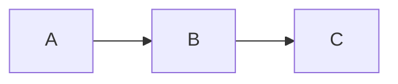

# Mermaid theme reference — Atom One Dark & Atom One Light

Two `%%{init:…}%%` blocks for use as the **first line inside any mermaid
code block**. Mermaid does not support global theme configuration in
static markdown, so each diagram needs its own init line. Pick the
variant that matches the surrounding document's color theme.

## Atom One Dark (for dark-themed pages)

Source of truth: `divine-book/style/mermaid-theme.txt`.

```
%%{init: {'theme': 'base', 'themeVariables': {'primaryColor': '#3e44514D', 'primaryTextColor': '#abb2bf', 'primaryBorderColor': '#4b5263', 'lineColor': '#61afef', 'secondaryColor': '#2c313a4D', 'secondaryTextColor': '#abb2bf', 'secondaryBorderColor': '#4b5263', 'tertiaryColor': '#282c344D', 'mainBkg': '#3e44514D', 'nodeBorder': '#4b5263', 'clusterBkg': '#2c313a4D', 'clusterBorder': '#4b5263', 'titleColor': '#e5c07b', 'edgeLabelBackground': '#282c34', 'textColor': '#abb2bf', 'background': '#282c34'}}}%%
```

## Atom One Light (for light-themed pages)

Source of truth: `forge/paper/style/mermaid-theme.txt`.

```
%%{init: {'theme': 'base', 'themeVariables': {'primaryColor': '#eef1f5', 'primaryTextColor': '#383a42', 'primaryBorderColor': '#a0a1a7', 'lineColor': '#4078f2', 'secondaryColor': '#e1e6ec', 'secondaryTextColor': '#383a42', 'secondaryBorderColor': '#a0a1a7', 'tertiaryColor': '#f5f7fa', 'mainBkg': '#eef1f5', 'nodeBorder': '#a0a1a7', 'clusterBkg': '#f5f7fa', 'clusterBorder': '#a0a1a7', 'titleColor': '#c18401', 'edgeLabelBackground': '#ffffff', 'textColor': '#383a42', 'background': '#ffffff'}}}%%
```

## Side-by-side variable reference

The two themes use the same mermaid variable names with palette-inverted
values. Variables are grouped by role.

### Page / canvas

| Variable | Atom One Dark | Atom One Light | Notes |
|---|---|---|---|
| `background` | `#282c34` | `#ffffff` | Mermaid canvas bg. Match surrounding page. |
| `edgeLabelBackground` | `#282c34` | `#ffffff` | Same as canvas bg so edge labels blend. |

### Nodes (primary)

| Variable | Atom One Dark | Atom One Light | Notes |
|---|---|---|---|
| `primaryColor` | `#3e44514D` | `#eef1f5` | Default node fill. Dark uses 30% alpha over dark bg; light uses solid for contrast on white. |
| `mainBkg` | `#3e44514D` | `#eef1f5` | Same as `primaryColor` (mermaid duplicates the role). |
| `primaryTextColor` | `#abb2bf` | `#383a42` | Body text on nodes. Lightness-inverted. |
| `primaryBorderColor` | `#4b5263` | `#a0a1a7` | Node borders. Both are mid-luma grays. |
| `nodeBorder` | `#4b5263` | `#a0a1a7` | Same as `primaryBorderColor`. |

### Nodes (secondary / tertiary)

| Variable | Atom One Dark | Atom One Light | Notes |
|---|---|---|---|
| `secondaryColor` | `#2c313a4D` | `#e1e6ec` | Alternate node fill (e.g., for state diagrams' second-tier nodes). |
| `secondaryTextColor` | `#abb2bf` | `#383a42` | Same as primary text. |
| `secondaryBorderColor` | `#4b5263` | `#a0a1a7` | Same as primary border. |
| `tertiaryColor` | `#282c344D` | `#f5f7fa` | Third-tier fill. Matches `clusterBkg`. |

### Clusters / subgraphs

| Variable | Atom One Dark | Atom One Light | Notes |
|---|---|---|---|
| `clusterBkg` | `#2c313a4D` | `#f5f7fa` | Subgraph background. Subtler than node fill. |
| `clusterBorder` | `#4b5263` | `#a0a1a7` | Subgraph border. |
| `titleColor` | `#e5c07b` | `#c18401` | Subgraph title text. Atom palette's yellow-orange in each scheme. |

### Edges / lines / general text

| Variable | Atom One Dark | Atom One Light | Notes |
|---|---|---|---|
| `lineColor` | `#61afef` | `#4078f2` | Edge color. Both are the Atom palette's blue (lightness-shifted). |
| `textColor` | `#abb2bf` | `#383a42` | General text outside nodes. |

## Why no alpha on the light theme

The dark theme uses `…4D` suffixes on `primaryColor`, `mainBkg`,
`secondaryColor`, `tertiaryColor`, `clusterBkg` — that's 30% alpha. The
trick layers a slightly darker shape over the dark page background,
producing "barely-lighter-than-page" node fills (Atom's signature
muted look).

On a white page, the same alpha trick produces nearly-invisible nodes
because anything mostly-transparent over white is washed out. The
light theme uses solid colors (`#eef1f5` for nodes, `#f5f7fa` for
clusters) chosen to be subtly tinted-blue gray — visible on white,
quiet enough not to compete with text.

## Why the title color flips hue

Both themes use the Atom palette's yellow-orange for `titleColor`:

- Atom One Dark: `#e5c07b` (a brighter yellow that reads on dark bg)
- Atom One Light: `#c18401` (a deeper yellow-orange that reads on light bg)

These are the canonical sister colors in the Atom palette — same hue
role, lightness adjusted for legibility against their respective
backgrounds.

## Usage

Paste the chosen theme as the **first line** inside the mermaid code
block:

````markdown

````

The init line is parsed by mermaid before the diagram body. Themes
apply per-diagram; you cannot configure once at the document level.

## Files

- `divine-book/style/mermaid-theme.txt` — dark theme one-liner
- `forge/paper/style/mermaid-theme.txt` — light theme one-liner
- `forge/paper/style/atom-one-light.css` — companion light CSS for HTML→PDF
- `divine-book/style/atom-one-dark.css` — companion dark CSS for HTML→PDF
